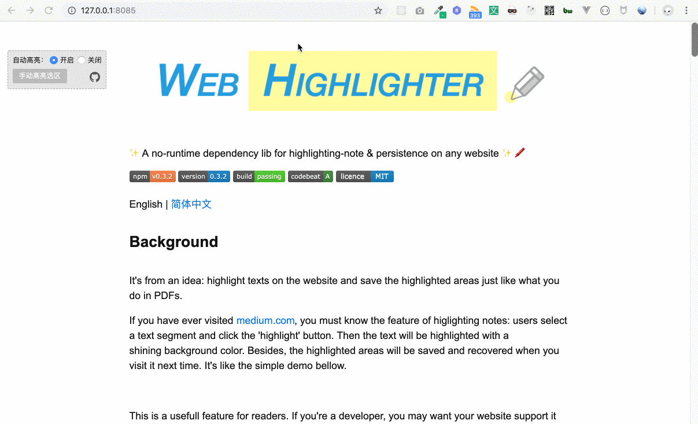

<div>
    <h1 align="center"><code>Web Highlighter</code>&nbsp;&nbsp;🖍️</h1>
    <p align="center">
        <strong>✨ 一个可以在任何网页上做高亮笔记前端库，支持高亮文本的持久化存储与还原 ✨🖍️</strong>
    </p>
    
    <p align="center">
        <a href="https://travis-ci.org/alienzhou/web-highlighter" target="_blank">
            
        </a>
        <a href="https://www.npmjs.com/package/web-highlighter" target="_blank">
            
        </a>
        <a href='https://coveralls.io/github/alienzhou/web-highlighter?branch=master'>
            
        </a>
        <a href="https://unpkg.com/web-highlighter" target="_blank">
            
        </a>
        <a href="https://codebeat.co/projects/github-com-alienzhou-web-highlighter-master" target="_blank">
            
        </a>
        <a href="https://opensource.org/licenses/mit-license.php" target="_blank">
            
        </a>
    </p>
</div>

---

[English](https://github.com/alienzhou/web-highlighter/blob/master/README.md) | 简体中文

##  1. <a name=''></a>背景

灵感来源：当有天我访问某个网页时，突然希望能够像在PDF上一样，对网页文本添加高亮笔记，并支持永久保存这些高亮笔记区域。

如果你曾经访问过 [medium.com](http://medium.com) 这个网站，你一定见到或用过它的高亮在线笔记功能：用户选择一个文本片段然后点击“高亮”按钮，接着，这段文本就被涂上了背景颜色。此外，这些高亮区域还被存储了下来，当你下次访问时会自动恢复。就像下面这个简单的示例一样。



对在线阅读器来说，这是一个非常有用的功能。如果你是开发者，也许你会希望在你的网页上支持该功能以吸引更多的读者；如果你是一名用户（像我一样），你可能会想要一个支持该功能的浏览器插件。

因此，「web-highlighter」仓库的目标就是帮助你在任意的网页上快速地实现高亮笔记功能（例如博客网页、文档阅读器、在线图书等）。它包含了文本高亮笔记与高亮持久化下场景的核心能力，并且支持通过它简单易用的 API 来实现你自己的产品需求。「web-highlighter」已经被用在了我们网站的生产环境中。


##  2. <a name='-1'></a>安装

```bash
npm i web-highlighter
```

##  3. <a name='-1'></a>使用方式

两行代码，即可开启文本选中时的自动高亮功能。

```JavaScript
import Highlighter from 'web-highlighter';
(new Highlighter()).run();
```

四行代码，实现高亮区域持久化。

```JavaScript
import Highlighter from 'web-highlighter';

// 1. 实例化
const highlighter = new Highlighter();

// 2. 从后端获取高亮信息，还原至网页
getRemoteData().then(s => highlighter.fromStore(s.startMeta, s.endMeta, s.id, s.text));

// 3. 监听高亮笔记创建事件，并将信息存至后端
highlighter.on(Highlighter.event.CREATE, ({sources}) => save(sources));

// 4. 开启自动划词高亮
highlighter.run();
```

##  4. <a name='-1'></a>示例

一个更复杂的使用示例。

```JavaScript
import Highlighter from 'web-highlighter';

// 不高亮 pre&code 元素
const highlighter = new Highlighter({
    exceptSelectors: ['pre', 'code']
});

// 添加一些交互监听
highlighter
    .on('selection:hover', ({id}) => {
        // 通过添加 class，实现类似 hover 效果
        highlighter.addClass('highlight-wrap-hover', id);
    })
    .on('selection:hover-out', ({id}) => {
        // 鼠标离开时清除悬停样式
        highlighter.removeClass('highlight-wrap-hover', id);
    })
    .on('selection:create', ({sources}) => {
        sources = sources.map(hs => ({hs}));
        // 存储
        store.save(sources);
    });

// 获取数据存储，将高亮区域还原展示在网页上
store.getAll().forEach(
    ({hs}) => highlighter.fromStore(hs.startMeta, hs.endMeta, hs.text, hs.id)
);

highlighter.run()
```

此外，该仓库还自带了一个 DEMO 示例（在`example`文件夹中）。启动该 DEMO 只需要 ——

首先安装运行依赖

```bash
npm i
```

然后启动

```bash
npm start
```

最后访问 http://127.0.0.1:8085/ 即可。

---

另一个使用 web-highlighter 开发的实际产品的例子（用于左侧高亮部分）：


##  5. <a name='-1'></a>工作原理

web-highlighter 会通过 [`Selection API`](https://caniuse.com/#search=selection%20api) 来读取被选择的文本范围。然后选区的信息会被转换为一个可序列化的数据结构，以便于能够发送并存储在后端。当用户再次访问你的页面时，这些存储的数据被返回然后在你的页面上进行反序列化。数据结构本身是技术栈无关的。所以你可以用在任意技术栈构建的页面上（例如 React、Vue、Angular 或者 jQuery 等等）。

想要了解更多实现细节，可以阅读[这篇文章](https://www.alienzhou.com/2019/04/21/web-note-highlight-in-js/)。

##  6. <a name='-1'></a>详细使用文档

###  6.1. <a name='-1'></a>配置项

```JavaScript
const highlighter = new Highlighter([opts])
```

创建一个新的 `highlighter` 实例.

`opts` 会合并至默认配置 (如下所示).

```JavaScript
{
    $root: document.documentElement,
    exceptSelectors: null,
    wrapTag: 'span',
    style: {
        className: 'highlight-mengshou-wrap'
    }
}
```

配置说明:

| 参数名 | 类型 | 描述 | 是否必须 | 默认值 |
|---|---|---|---|---|
| $root | `Document | HTMLElement` | 高亮区域的根容器元素 | 否 | `document` |
| exceptSelectors | `Array<string>` | 过滤器，符合的元素将不会被高亮 | 否 | `null` |
| wrapTag | `string` | 用于包裹高亮文本的 HTML 标签名 | 否 | `span` |
| verbose | `boolean` | 是否需要输出警告和错误信息 | 否 | `false` |
| style | `Object` | 用于控制高亮区域的样式 | 否 | 详见下方 |

`style` 属性配置:

| 参数名 | 类型 | 描述 | 是否必须 | 默认值 |
|---|---|---|---|---|
| className | `string` | 高亮包裹元素的 className | 否 | `highlight-mengshou-wrap` |

`exceptSelectors` 为 `null` 或 `Array<string>`。 支持 ID 选择器、类选择器和标签选择器。例如，想要忽略标签为 h1 和 classname 为 `.title` 的元素：

```JavaScript
var highlighter = new Highlighter({
    exceptSelectors: ['h1', '.title']
});
```

###  6.2. <a name='-1'></a>静态方法

####  6.2.1. <a name='Highlighter.isHighlightSourcesource'></a>`Highlighter.isHighlightSource(source)`

用于判断 `source` 参数是否为一个 highlight source 对象。如果是则返回 `true`, 反之亦然.

####  6.2.2. <a name='Highlighter.isHighlightWrapNodenode'></a>`Highlighter.isHighlightWrapNode($node)`

用于判断 `$node` 参数是否为一个高亮包裹元素。如果是则返回 `true`, 反之亦然.

###  6.3. <a name='-1'></a>实例方法

####  6.3.1. <a name='highlighter.run'></a>`highlighter.run()`

开启自动划词高亮。当用户选择了一段文本时，「web-highlighter」会自动为其添加高亮效果。

####  6.3.2. <a name='highlighter.stop'></a>`highlighter.stop()`

关闭自动划词高亮。

####  6.3.3. <a name='highlighter.dispose'></a>`highlighter.dispose()`

当你不再需要使用高亮功能时，需要先使用该方法来移除一些事件监听，回收一些资源。

####  6.3.4. <a name='highlighter.fromRangerange'></a>`highlighter.fromRange(range)`

该方法支持你传一个 [`Range`](https://developer.mozilla.org/en-US/docs/Web/API/Range)，并基于该对象进行高亮笔记操作。你可以通过 `window.getSelection().getRangeAt(0)` 方法来获取一个 range 对象，或者使用 `document.createRange()` 方法来创建一个新的 range 对象。

如下所示：

```JavaScript
const selection = window.getSelection();
if (!selection.isCollapsed) {
    highlighter.fromRange(selection.getRangeAt(0));
}
```

####  6.3.5. <a name='highlighter.fromStorestartendtextid'></a>`highlighter.fromStore(start, end, text, id)`

大多数情况下，这个 API 用于通过后端的持久化信息还原出文本高亮效果。

其中四个所需的参数来源于 `HighlightSource` 对象。`HighlightSource` 对象是一个特殊的对象，当高亮笔记被添加时会被创建。为了能在后端实现数据持久化，它需要找到一种能表示 dom 节点的数据结构。这个结构在 web-highlighter 内被称为`HighlightSource`。

四个参数的含义如下：

- start `Object`:    开始节点的源信息
- end   `Object`:    结束节点的源信息
- text  `string`:    文本内容
- id    `string`:    高亮的唯一 ID

####  6.3.6. <a name='highlighter.removeid'></a>`highlighter.remove(id)`

清除指定 id 的高亮区域。该 id 默认会由 web-highlighter 在创建高亮区域使生成。你也可以通过添加钩子来应用你自己的 id 生成规则。钩子相关文档可以[看这里](https://github.com/alienzhou/web-highlighter/blob/master/docs/ADVANCE.zh_CN.md)。

####  6.3.7. <a name='highlighter.removeAll'></a>`highlighter.removeAll()`

清除根节点下的所有高亮区域。

####  6.3.8. <a name='highlighter.addClassclassnameid'></a>`highlighter.addClass(classname, id)`

为某个 id 的高亮区域添加 CSS 类名。你可以通过这个 API 来改变某个高亮区域的样式。

####  6.3.9. <a name='highlighter.removeClassclassnameid'></a>`highlighter.removeClass(classname, id)`

移除某个 id 的高亮区域的指定 CSS 类名。类似于 `highlighter.addClass` 的逆操作。

####  6.3.10. <a name='highlighter.getDomsid'></a>`highlighter.getDoms([id])`

获取高亮区域内的所有包裹节点。一个高亮区域可能会包含多个片段。它会返回所有这些片段的包裹节点（DOM 节点）。

如果 `id` 参数留空，它会返回根节点下的所有高亮区域中的包裹节点。

####  6.3.11. <a name='highlighter.getIdByDomnode'></a>`highlighter.getIdByDom(node)`

传入一个 DOM 节点，返回该节点对应的高亮区域的唯一 ID。支持传入非包裹元素。如果是非包裹，则会自动找到最近的祖先包裹元素。

####  6.3.11. <a name='highlighter.getExtraIdByDomnode'></a>`highlighter.getExtraIdByDom(node)`

传入一个 DOM 节点，返回该节点对应的高亮区域的额外 ID。支持传入非包裹元素。如果是非包裹，则会自动找到最近的祖先包裹元素。

####  6.3.12. <a name='highlighter.setOptionopt'></a>`highlighter.setOption(opt)`

可以使用该 API 改变实例的配置项，参数结构和构造函数中的一致，支持传入部分参数。

###  6.4. <a name='EventListener'></a>`Event Listener`

web-highlighter 使用监听器方式来处理异步事件。

例如下面这样，

```JavaScript
var highlighter = new Highlighter();
highlighter.on(Highlighter.event.CREATE, function (data, inst, e) {
    // ...
});
```

回调函数接受三个参数：

- data `any`: 事件触发时的具体数据
- inst `Highlighter`: 当前 Highlighter 类的实例
- e `Event`: 某些事件会有浏览器触发（例如点击）, web-highlighter 会将浏览器原生 event 对象暴露出来

`Highlighter.event` 是内部的 `EventType` 类型. 它包含了如下这些事件：

- `EventType.CLICK`: 点击高亮区域
- `EventType.HOVER`: 鼠标移至高亮区域，类似 mouse enter
- `EventType.HOVER_OUT`: 鼠标移出高亮区域，类似 mouse leave
- `EventType.CREATE`: 高亮区域被创建
- `EventType.REMOVE`: 高亮区域被清除

对于不同的事件类型，其 `data` 所包含的具体属性如下：

####  6.4.1. <a name='EventType.CLICK'></a>`EventType.CLICK`

|name|description|type|
|---|---|---|
|`id`| 高亮区域唯一 ID |string|

####  6.4.2. <a name='EventType.HOVER'></a>`EventType.HOVER`

|name|description|type|
|---|---|---|
|`id`| 高亮区域唯一 ID |string|

####  6.4.3. <a name='EventType.HOVER_OUT'></a>`EventType.HOVER_OUT`

|name|description|type|
|---|---|---|
|`id`| 高亮区域唯一 ID |string|

####  6.4.4. <a name='EventType.CREATE'></a>`EventType.CREATE`

> 不包含参数 `e`

|name|description|type|
|---|---|---|
|`source`|`HighlightSource` 对象|Array|
|`type`|高亮区域创建的来源|string|

`source` 是一个 `HighlightSource` 对象。该对象在高亮区域被创建时，会由 web-highlighter 创建并传给回调函数。为了能够在后端（数据库中）进行高亮数据的持久化，需要使用一个可以被序列化（`JSON.stringify()`）的数据结构来表示浏览器中的 DOM 节点。`HighlightSource` 就是 web-highlighter 提供的来用于持久化的数据对象。

`type` 用来告知开发者高亮区域被创建的原因。目前 `type` 包含两种可能的值：`from-input` 和 `from-store`。`from-input` 表明该高亮区域是通过用户操作（用户划词的选区）创建的；`from-store` 则表示该高亮区域是通过持久化的 `HighlightSource` 中的数据还原出来的。

####  6.4.5. <a name='EventType.REMOVE'></a>`EventType.REMOVE`

> 不包含参数 `e`

|name|description|type|
|---|---|---|
|`ids`|一组高亮区域唯一 ID|Array<string>|

###  6.5. <a name='Hooks'></a>Hooks（钩子）

钩子可以用来更好地控制整个高亮流程。通过它你几乎可以实现任何自定义的逻辑。详细内容请参考[下面部分](#更多使用方式)。

##  7. <a name='-1'></a>兼容性

> 依赖 [Selection API](https://caniuse.com/#search=selection%20api)。

- IE 11
- Edge
- Firefox 52+
- Chrome 15+
- Safari 5.1+
- Opera 15+

_**移动端支持：**_ 如果检测为移动端，则会自动使用相应的事件监听来替代 PC 端事件。

##  8. <a name='-1'></a>更多使用方式

为了便于开发者更好地控制相关的高亮行为，web-highlighter 提供一些内部的钩子。

想了解内部钩子及其使用方式，可以阅读[这篇文档](https://github.com/alienzhou/web-highlighter/blob/master/docs/ADVANCE.zh_CN.md)。

##  9. <a name='-1'></a>许可证

[MIT](./LICENCE)
