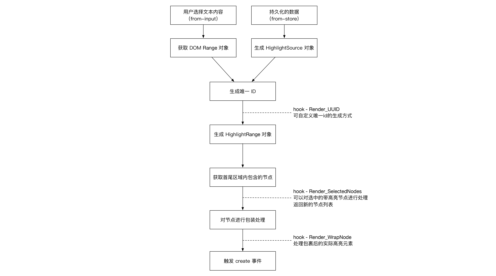
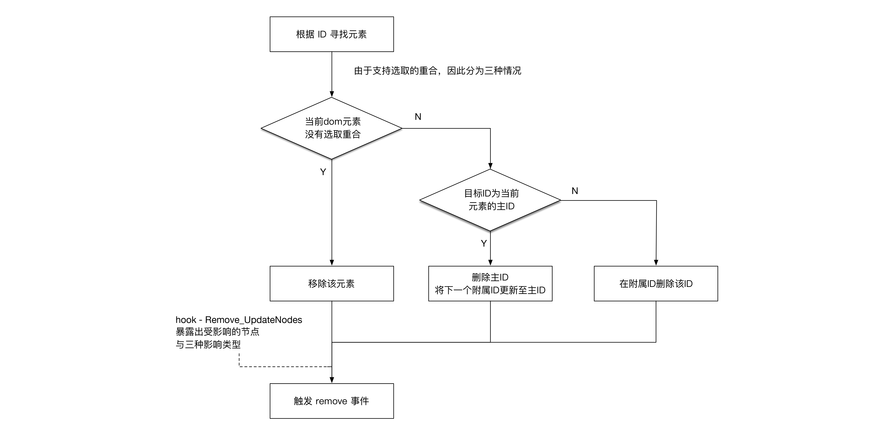

# Advance

对象间关系：

```text
  (UserAgent)   |   (Highlighter lib)
                |
                |    Storage
                |      ⇅
                |    HighlightSource: pure type json
                |      ⇅
Range/Selection → →  HighlightRange: json with dom node
                |      ↓
                |    Paint: Highlighter.Paint
                |      ↓
                |    highlight in webpage
```

## 高亮选区创建流程



## 高亮选区删除流程



## 钩子

使用样例：

```JavaScript
var highlighter = new Highlighter();
highlighter.hooks.Render.UUID.tap(function (start, end, text) {
    // 生成 id
    return id;
});
```

### Render.UUID

操作UUID（选区id）的生成。

接受参数：

- start: 起始节点的信息
- end: 终止节点的信息
- text: 文本内容

返回值：

生成的选区 id

### Render.SelectedNodes

操作高亮选区所包含的所有文本节点

接受参数：

- id: 高亮id
- selectedNodes: 当前高亮被选择的所有文本节点

返回值：

- 需要被高亮包裹的所有文本节点

### Render.WrapNode

操作高亮包裹后的元素

接受参数：

- id: 高亮id
- node: 高亮包裹的节点

返回值：

- 高亮包裹的节点

### Serialize.RecordInfo

为选区序列化时的持久化数据生成额外信息

接受参数：

- start: 起始节点的元数据
- end: 终止节点的元数据
- root: 选区根元素

返回值：

- 持久化信息中的额外数据

### Remove.UpdateNode

删除选区时，对更新的节点进行操作

接受参数：

- id: 高亮id
- node: 需要更新的节点
- type: 更新的类型 (remove|id-update|extra-update)

无返回值
