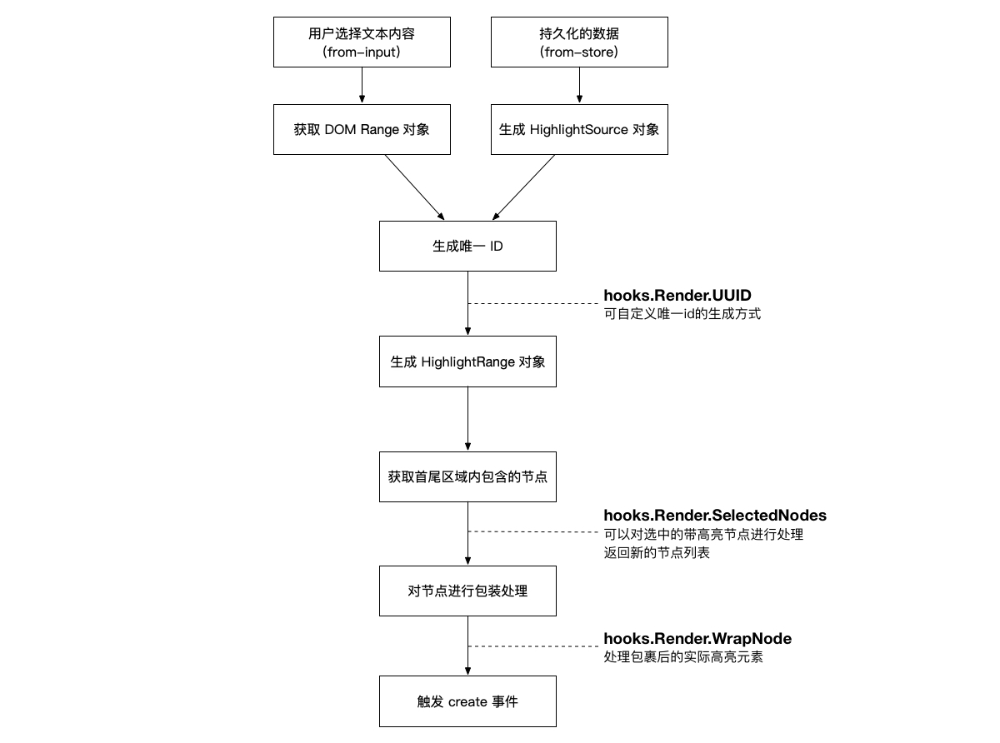
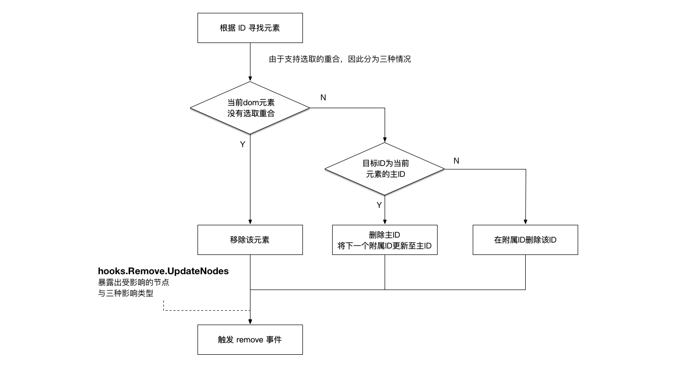

# 内部工作流程与钩子

[English](./ADVANCE.md) | 简体中文

这一部分将会介绍

- web-highlighter 是如何创建与清除高亮选区的
- 各个钩子的触发时机及其用途


## 工作流程

### 高亮选区创建流程



### 高亮选区清除流程



## 钩子的使用

```JavaScript
const highlighter = new Highlighter();
highlighter.hooks.Render.UUID.tap(function (start, end, text) {
    // 生成 id
    return id;
});
```

## 钩子列表

### `Render.UUID`

自定义UUID（选区id）的生成。

**参数：**

- start: 起始节点的信息
- end: 终止节点的信息
- text: 文本内容

**所需的返回值：**

- 生成的选区 id

### `Render.SelectedNodes`

操作高亮选区所包含的所有文本节点

**参数：**

- id: 高亮 id
- selectedNodes: 当前高亮被选择的所有文本节点

**所需的返回值：**

- 需要被高亮元素包裹的所有文本节点

### `Render.WrapNode`

操作高亮包裹后的元素

**参数：**

- id: 高亮 id
- node: 高亮包裹的节点

**所需的返回值：**

- 高亮包裹的节点

### `Serialize.Restore`

自定义你的还原（反序列化）方法。当你使用这个钩子时，`HighlightSource` 实例会调用你注册的方法来计算高亮选区的首尾节点信息。

**参数:**

- hs: 当前的 `HighlightSource` 实例

**所需的返回值:**

- 一个数组对象: 数组的第一个元素是选区开始的节点信息，第二个元素是结束的节点信息

### `Serialize.RecordInfo`

为选区序列化时的持久化数据生成额外信息

**参数：**

- start: 起始节点的元数据
- end: 终止节点的元数据
- root: 选区根元素

**所需的返回值：**

- 持久化信息中的额外数据，会被添加到 `HighlightSource` 的 `extra` 字段里

### `Remove.UpdateNodes`

删除选区时，对受影响的节点进行自定义操作

**参数：**

- id: 高亮id
- node: 收到影响的节点
- type: 更新的类型，包括三种：`remove`、`id-update` 和 `extra-update`

**所需的返回值：**

- 无需返回值
